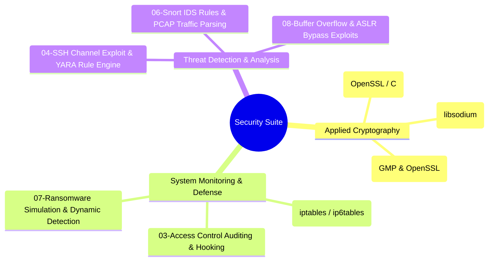

# Systems, Cryptography & Network Security Suite

[](https://en.wikipedia.org/wiki/C_(programming_language))
[](https://www.python.org/)
[](https://www.gnu.org/software/bash/)
[](https://www.openssl.org/)
[](https://libsodium.gitbook.io/)
[](https://www.kernel.org/)
[](https://netfilter.org/)
[](https://www.snort.org/)
[](https://virustotal.github.io/yara/)

An engineering suite covering **low-level systems security, applied cryptography, network defense, intrusion detection, and exploit analysis**. Developed as part of advanced computer engineering coursework at the **Technical University of Crete (TUC)**.

---

## Suite Architecture & Modules



---

## Module Breakdown

### [01. Mutual TLS Client-Server (mTLS)](file:///C:/Users/stath/Downloads/portfolio-assets/system-network-security/01-mutual-tls-server)
- **Technologies:** C, OpenSSL, POSIX Sockets
- **Core Concept:** Implementation of bidirectional TLS authentication (Mutual TLS) where both client and server cryptographically verify X.509 certificates against a shared Certificate Authority (CA) before establishing an encrypted tunnel.
- **Key Files:** `server.c`, `client.c`, `rclient.c`, `Makefile`

### [02. Cryptographic Protocols — ECDH & RSA](file:///C:/Users/stath/Downloads/portfolio-assets/system-network-security/02-crypto-ecdh-rsa)
- **Technologies:** C, libsodium, GNU Multiple Precision Arithmetic Library (GMP), OpenSSL
- **Core Concept:**
  - **Elliptic Curve Diffie-Hellman (ECDH):** Ephemeral key exchange with key derivation (KDF) leveraging `libsodium` Curve25519.
  - **RSA Cryptosystem:** Custom large-prime modular arithmetic implementation using `GMP` for key pair generation, encryption/decryption, and SHA-256 digital signature verification.
- **Key Files:** `ecdh_assign_2.c`, `rsa_assign_2.c`, `Makefile`

### [03. Dynamic Access Control & Audit Logging](file:///C:/Users/stath/Downloads/portfolio-assets/system-network-security/03-access-control-logger)
- **Technologies:** C, Linux Shared Library Injection (`LD_PRELOAD`)
- **Core Concept:** Real-time userland interception of sensitive POSIX file operations (`fopen`, `fwrite`, `fread`). The logger logs access attempts, cryptographic hashes of file content, and access action types, while a separate audit monitor program parses audit trails to identify privilege escalation and unauthorized read/write violations.
- **Key Files:** `audit_logger.c`, `audit_monitor.c`, `test_audit.c`, `Makefile`

### [04. SSH Channel Exploitation & YARA Detection](file:///C:/Users/stath/Downloads/portfolio-assets/system-network-security/04-ssh-vulnerability-yara)
- **Technologies:** Python 3, Paramiko, YARA Rule Engine
- **Core Concept:** Analysis of packet sequence and state manipulation vulnerabilities on SSH transport channels. Features custom YARA signatures (`paramiko_tester.yara`) designed to identify malicious tampering or vulnerable cryptographic configurations in memory and network streams.
- **Key Files:** `paramiko_tester.yara`, `channel_modified.py`

### [05. Stateful Linux Firewall (iptables & ip6tables)](file:///C:/Users/stath/Downloads/portfolio-assets/system-network-security/05-network-firewall-iptables)
- **Technologies:** Bash, Netfilter, Linux `iptables`, `ip6tables`
- **Core Concept:** Defense-in-depth network boundary filtering. Enforces strict default-drop policies, stateful connection tracking (`ESTABLISHED`, `RELATED`), anti-spoofing constraints, ICMP rate limiting, and granular port whitelisting for dual-stack IPv4 and IPv6 traffic.
- **Key Files:** `firewall.sh`, `rulesV4`, `rulesV6`

### [06. Snort IDS & PCAP Network Traffic Analysis](file:///C:/Users/stath/Downloads/portfolio-assets/system-network-security/06-snort-ids-pcap-analysis)
- **Technologies:** Snort, Python, Wireshark / PCAP, Scapy
- **Core Concept:** Custom Snort signature creation detecting SQL Slammer Worm payloads (port 1434 overflow signatures), DNS covert channels and exfiltration, Base64 obfuscated packet data, and automated programmatic PCAP traffic parsing in Python.
- **Key Files:** `local.rules`, `part2.py`, `traffic.pcap`

### [07. Behavioral Ransomware Simulation & Defense](file:///C:/Users/stath/Downloads/portfolio-assets/system-network-security/07-ransomware-simulation-defense)
- **Technologies:** Bash, OpenSSL AES-256-CBC, C Interceptor
- **Core Concept:** Controlled simulation of symmetric encryption ransomware traversing directory trees. Evaluated alongside the `LD_PRELOAD` audit monitor to benchmark behavioral detection latency and automated containment strategies.
- **Key Files:** `ransomware.sh`, `audit_logger.c`, `audit_monitor.c`

### [08. Binary Exploitation & ASLR Bypass](file:///C:/Users/stath/Downloads/portfolio-assets/system-network-security/08-binary-exploitation-buffer-overflow)
- **Technologies:** C, Python (pwntools style payload delivery), GDB, GCC security flags
- **Core Concept:** In-depth memory corruption vulnerability study across three mitigation levels:
  1. Standard stack buffer overflow and instruction pointer overwrite (`greeter_exploit.py`).
  2. Non-executable stack (NX) and stack canary evasion (`secGreeter_exploit.py`).
  3. Address Space Layout Randomization (ASLR) entropy analysis and execution vector bypassing (`secGreeterASLR_exploit.py`).
- **Key Files:** `greeter_exploit.py`, `secGreeter_exploit.py`, `secGreeterASLR_exploit.py`, `Makefile`

---

## Build & Dependencies

### System Requirements (Linux / POSIX)
```bash
# Ubuntu / Debian
sudo apt-get update
sudo apt-get install -y build-essential libssl-dev libsodium-dev libgmp-dev iptables snort yara python3 python3-pip
```

### Compiling Modules
Each module contains a self-contained `Makefile`:
```bash
# Example: Building Cryptographic Tools
cd 02-crypto-ecdh-rsa
make

# Example: Building Access Control Logger
cd ../03-access-control-logger
make

# Example: Building Buffer Overflow Targets
cd ../08-binary-exploitation-buffer-overflow
make
```

---

## Author & Academic Affiliation

**Dimitris Stathoulias**  
School of Electrical & Computer Engineering (ECE), Technical University of Crete (TUC)  
- **GitHub:** [@dstathoulias](https://github.com/dstathoulias)  
- **Email:** [stath.jim2000@gmail.com](mailto:stath.jim2000@gmail.com)
